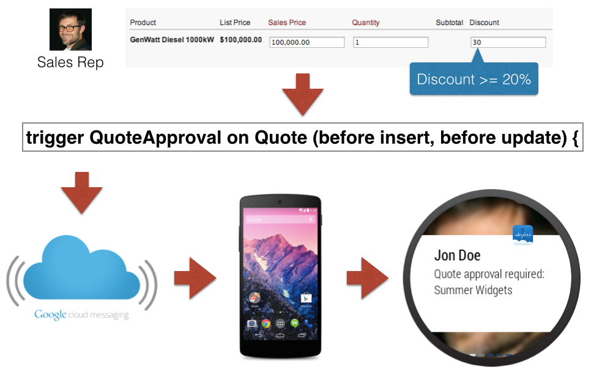

Salesforce Wear Pack for Android Wear
------------------------------------------------------------------------------

As smart watches and other human-integrated devices make their way into the mainstream, developers need to quickly ramp up to these new paradigms and interaction models.  Wearables form a constant connection between us and the information we interact with.  As an example, when I'm out on a bike ride if something comes up that needs my approval it would be great if I could just glance down at my watch and quickly review the item, then either approve or reject it.  With Salesforce and Android Wear I could do all of this without stopping and pulling my phone out of my pocket!

Check out a [demo video on YouTube](https://www.youtube.com/watch?v=vrjYEvn9sxE) of a sample app that does exactly that.

As you can see, Android Wear apps are companions to phone apps--they receive notifications and allow the user to take quick actions based on targeted information.  This interaction model is based on information that can be consumed and acted upon at a glance.

For most businesses, Salesforce contains the information and events that employees, partners, and customers interact with on a daily basis.  So it is easy to link together events on Salesforce with notifications on Android Wear devices.

The basic architecture looks like this:

1. A trigger in Salesforce handles an event that should trigger an Android Wear notification.
2. A message is created and sent to the Google Cloud Messaging (GCM) service using the new Mobile Push feature of Salesforce (Available in the Summer '14 release).
3. GCM delivers the notification to an Android phone.
4. The Android phone delivers the notification to the wearable.

The *Quote Discount Approval* sample app contains the source for a Salesforce and Android Wear app that uses this architecture for a common use case.  Often sales quotes with a discount above a certain number need to be approved by a sales manager.  With this sample app those approval requests can be reviewed and approved or rejected from an Android Wear device, such as a watch.  Here is what the flow looks like in this sample app:



Check out the [full instructions](https://github.com/developerforce/WearablePack-AndroidWear/blob/master/samples/QuoteDiscountApproval/README.md) for getting the *Quote Discount Approval* app up and running in your environment.

In the *Quote Discount Approval* sample app there is a Salesforce approval process that requires manager approval of `Quotes` which have discounts at or above 20%.  The metadata for that approval process is available in the [src/main/salesforce/unpackaged/approvalProcesses/Quote.QuoteDiscountApproval.approvalProcess](https://github.com/developerforce/WearablePack-AndroidWear/blob/master/samples/QuoteDiscountApproval/src/main/salesforce/unpackaged/approvalProcesses/Quote.QuoteDiscountApproval.approvalProcess) file.

An Apex trigger defined in [src/main/salesforce/unpackaged/triggers/QuoteApproval.trigger
](https://github.com/developerforce/WearablePack-AndroidWear/blob/master/samples/QuoteDiscountApproval/src/main/salesforce/unpackaged/triggers/QuoteApproval.trigger) creates the approval process and uses the Mobile Push API to send a notification to the approving manager's Android phone.  Here is a snippet of that code:
```
Messaging.PushNotification msg = new Messaging.PushNotification();

Map<String, Object> payload = new Map<String, Object>();
payload.put('ownerName', owner.Name);
...
msg.setPayload(payload);

String userId = result.actorIds[0];
Set<String> users = new Set<String>();
users.add(userId);

msg.send('QuoteDiscountApproval', users);
```

As you can see, the Apex API for creating a new mobile notification is very simple.  On the native Android side handling the notification is also very simple, since the Salesforce Native Android library has built-in support for this.   The main app is defined in [src/main/java/com/force/quotediscountapproval/app/QuoteDiscountApprovalApp.java](https://github.com/developerforce/WearablePack-AndroidWear/blob/master/samples/QuoteDiscountApproval/src/main/java/com/force/quotediscountapproval/app/QuoteDiscountApprovalApp.java), and registers a notification receiver when the app is started:

    SalesforceSDKManager.getInstance().setPushNotificationReceiver(new QuotePushNotification(this));

The `QuotePushNotification` class is defined in [src/main/java/com/force/quotediscountapproval/app/QuotePushNotification.java](https://github.com/developerforce/WearablePack-AndroidWear/blob/master/samples/QuoteDiscountApproval/src/main/java/com/force/quotediscountapproval/app/QuotePushNotification.java), and handles the push notification by creating an Android notification which is displayed on the watch.  The following code excerpt does that:

```
WearableNotifications.Builder wearableBuilder = new WearableNotifications.Builder(mainNotification);

wearableBuilder
    .addPage(detailNotification)
    .addAction(rejectAction);

mainNotification
    .setContentIntent(openPendingIntent);

NotificationManagerCompat.from(context)
    .notify(1, wearableBuilder.build());
```

The Approve and Reject actions are handled by the [src/main/java/com/force/quotediscountapproval/app/QuoteDiscountApprovalActions.java](https://github.com/developerforce/WearablePack-AndroidWear/blob/master/samples/QuoteDiscountApproval/src/main/java/com/force/quotediscountapproval/app/QuoteDiscountApprovalActions.java) file.  Those actions use the Salesforce REST API to update the approval process:

```
JSONObject approvalRequest = new JSONObject();
approvalRequest.put("actionType", action);
approvalRequest.put("contextId", workItemId);
approvalRequest.put("comments", comments);

JSONArray requests = new JSONArray();
requests.put(approvalRequest);

JSONObject json = new JSONObject();
json.put("requests", requests);

StringEntity entity = new StringEntity(json.toString(), HTTP.UTF_8);
entity.setContentType("application/json");

String url = "/services/data/" + c.getString(R.string.api_version) + "/process/approvals/";

final RestRequest restRequest = new RestRequest(RestRequest.RestMethod.POST, url, entity);

QuoteDiscountApprovalSetup.client.sendAsync(restRequest,
    new RestClient.AsyncRequestCallback() {
        @Override
        public void onSuccess(RestRequest request, RestResponse result) { }

        @Override
        public void onError(Exception exception) { }
    }
);
```

That is really all there is to building Salesforce Android Wear apps!  To get started download the [Salesforce Wearable Pack for Android Wear](https://github.com/developerforce/WearablePack-AndroidWear) and use the *Quote Discount Approval* app as a starting point.
